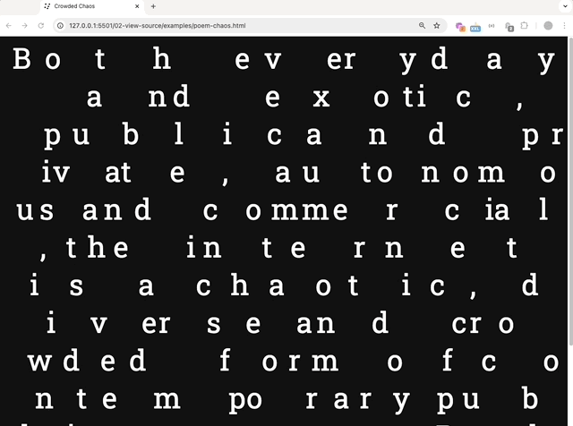
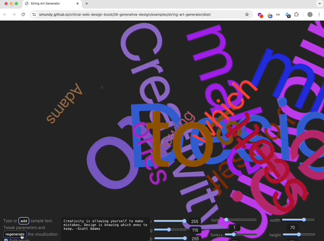

# Critical Web Design

A collection of examples and exercises to accompany _Critical Web Design_ by xtine burrough and Owen Mundy.

> Critical Web Design teaches readers to conceptualize, design, and program responsive websites as both an applied and creative practice. Readers will develop and use technical skills in interface design, usability/accessibility, and coding in HTML/CSS and Javascript, as well as speculative and critical design methods for imagining and producing online works that address issues relevant to design and technology in society. 

## Chapter 1 Networks

By the end of the modules in this chapter you will create and publish your first web page using a code playground and then Github Pages. 

Examples: 
[Codepen.io](https://bit.ly/cwd-codepen-hello-world), 
[Glitch.com](https://glitch.com/edit/#!/dig245-hello-world),
[...](https://github.com/criticalwebdesign/book/tree/main/01-networks/examples/)

 &nbsp; 

## Chapter 2 View Source

Design and code a page featuring expressive typography. Start by pre-visualizing the design in Figma and then code the page using HTML, CSS, and Javascript. The text can be any glyph, a single word, or one of the texts at [designmanifestos.org](https://designmanifestos.org). 

Examples: 
[Poem (Think)](https://criticalwebdesign.github.io/book/02-view-source/examples/poem-think.html), 
[Poem (Chaos)](https://criticalwebdesign.github.io/book/02-view-source/examples/poem-chaos.html), 
[Poem (Click)](https://criticalwebdesign.github.io/book/02-view-source/examples/poem-click.html), 
[Poem (Shake)](https://criticalwebdesign.github.io/book/02-view-source/examples/poem-shake.html), 
[After Gerhard Rühm](https://criticalwebdesign.github.io/book/02-view-source/examples/after-ruhm.html), 
[Don't Be Evil](https://criticalwebdesign.github.io/book/02-view-source/examples/poem-evil.html),
[...](https://github.com/criticalwebdesign/book/tree/main/02-view-source/examples/)

 &nbsp; &nbsp; 
 &nbsp; &nbsp; &nbsp;

 <!-- &nbsp; -->

## Chapter 3 Critical Design

Throughout the modules in this chapter you will redesign a logo to create a visual form incorporating commentary. You will use Figma to iterate on the design, considering typographic choices using Google Fonts, and create a web page with interactive images and Javascript to express your ideas. 

Examples: 
[Time](https://criticalwebdesign.github.io/book/03-critical-design/examples/ikea-time/), 
[Monopoly](https://criticalwebdesign.github.io/book/03-critical-design/examples/adobe-monopoly), 
[...](https://github.com/criticalwebdesign/book/tree/main/03-critical-design/examples)

 &nbsp;

## Chapter 4 On the Grid

Design a responsive multi-column web page layout for a fictional newspaper. Use lorem ipsum placeholder text throughout your design. Code the page using the Bootstrap CSS framework. 

Examples: 
[The New York Felines](https://criticalwebdesign.github.io/book/04-on-the-grid/examples/the-new-york-felines/), 
[The New York Thymes](https://criticalwebdesign.github.io/book/04-on-the-grid/examples/the-new-york-thymes/),
[...](https://github.com/criticalwebdesign/book/tree/main/04-on-the-grid/examples/)

<!-- individual breakpoints -->
<!-- 
 &nbsp; &nbsp; &nbsp; 
 &nbsp; &nbsp;
-->

 &nbsp;

## Chapter 5 Usability & Forms

Create and implement a usability test, then design a responsive web page to reflect on findings. Evaluate your design using the "less is more" critique. Code the design using Bootstrap, including a working web form to calculate and display the score from the System Usability Scale (SUS) survey. 

Examples: 
[AIGA usability test](https://criticalwebdesign.github.io/book/05-usability/examples/usability-aiga/),
[...](https://github.com/criticalwebdesign/book/tree/main/05-usability/examples/)

<!-- individual breakpoints -->
<!-- 
 &nbsp; &nbsp; &nbsp;
 -->

## Chapter 6 Off the Grid

Create an experimental composition and then explode it!

Examples: 
[Haiku (xtine)](https://criticalwebdesign.github.io/book/06-off-the-grid/examples/module6.3-finish.html), 
[Haiku (Birds)](https://criticalwebdesign.github.io/book/06-off-the-grid/examples/birds.html), 
[After James Baldwin](https://criticalwebdesign.github.io/book/06-off-the-grid/examples/baldwin.html), 
[Maintenance is a Drag](https://criticalwebdesign.github.io/book/06-off-the-grid/examples/maintenance.html),
[...](https://github.com/criticalwebdesign/book/tree/main/06-off-the-grid/examples/)

<!-- 
 -->

 &nbsp; &nbsp; &nbsp;

## Chapter 7 Ethical Design

Create an interactive feature that tells a story with data to accompany an article about the human impact of web accessibility. The idea should communicate 6 key statistics (%s) about accessibility while underscoring how non-accessible websites can exclude users with permanent or temporary disabilities. 

Examples: 
[Accessibility Data](https://criticalwebdesign.github.io/book/07-ethical-design/examples/accessibility-data),
[...](https://github.com/criticalwebdesign/book/tree/main/07-ethical-design/examples/)

<!-- 
 &nbsp; &nbsp; 
-->

 &nbsp;

## Chapter 8 Generative Design

This chapter prompt leads you to design and code a web page that can generate new iterations of itself based on some changeable data source, like user input, time, location, etc.

Examples: 
[Generative (Jean) Arp](https://criticalwebdesign.github.io/book/08-generative-design/examples/generative-arp), 
[Band Name Generator](https://criticalwebdesign.github.io/book/08-generative-design/examples/band-name-generator), 
[String Art Generator](https://criticalwebdesign.github.io/book/08-generative-design/examples/string-art-generator/dist), 
[Music Venue Generator](https://criticalwebdesign.github.io/book/08-generative-design/examples/music-venue-generator.html),
[...](https://github.com/criticalwebdesign/book/tree/main/08-generative-design/examples/)

  &nbsp; &nbsp;

## Chapter 9 Data Tracking

Examine what data is being collected, processed, and used against you using DevTools, and then create a "bad password generator" that encourages others to increase their digital security and resist the surveillance of everyday life.

Examples: 
[bad-password-api.glitch.me](https://bad-password-api.glitch.me/),
[...](https://github.com/criticalwebdesign/book/tree/main/09-data-tracking/examples/)

## Chapter 10 Design & Power

Use Node.js, an SQLite database, and Leaflet to built an interactive site that visualizes feelings contributed by users around the world on an interactive map. 

Examples: 
[big-feelings.glitch.me](https://big-feelings.glitch.me/)

